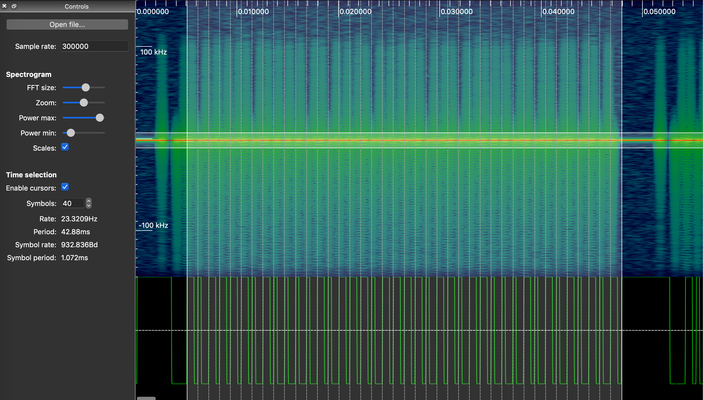

# rpitx-fake-ook
Generate a fake OOK from rptix RF mode

## How does it works ?
OOK stands for On/Off Keying. Technically rpitx cannot generate pure OOK signal. The OOK signal is generated by using the RF mode with two frequencies that dupe the receiver. The main frequency (f_ON) is centered on the receiver frequency and the alternative frequency (f_OFF) is shifted far enough so that the receiver doesn't trigger it.

## Example
The signal generated by `fake-ook-CMD.py` reproduces the following signal (captured from original transmitter)

The payload is [ 1, 0, 1, 1, 1, 1, 0, 1, 0, 0, 0, 0, 1, 0, 1, 1, 1, 0, 1, 1, 1, 1, 0, 1, 1, 0, 1, 1, 0, 0, 0, 1, 0, 0, 1, 1, 0, 0, 1, 1 ]

## How to get it work ?
Run `fake-ook-CMD.py` to generated the .rf file

Then transmit the signal with rpitx according to the command line displayed by the script

`sudo rpitx -i fake-ook-CMD.rf -m RF -s 27900 -f 434000`

You will need to adapt the script for your own usage:

* BAUDRATE
* SYMBOL DESIGN
* HEADER and TAIL
* PAYLOAD
* FREQUENCY